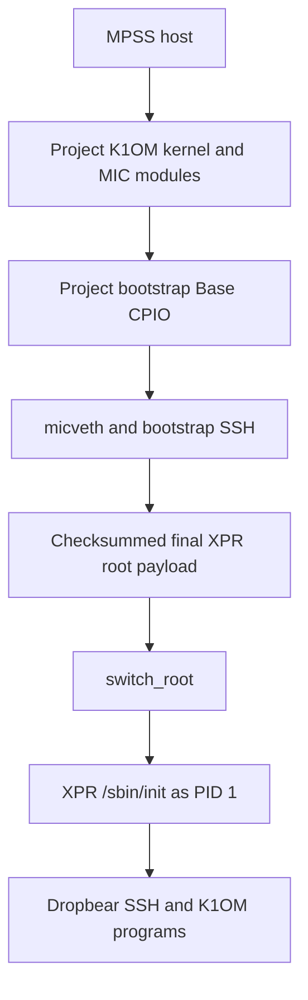

# The XPR-OS Boot Process

```mermaid
flowchart TD
  H[MPSS host] --> K[Project K1OM kernel and MIC modules]
  K --> B[Project bootstrap Base CPIO]
  B --> N[micveth and bootstrap SSH]
  N --> P[Checksummed final XPR root payload]
  P --> S[switch_root]
  S --> I[XPR /sbin/init as PID 1]
  I --> D[Dropbear SSH and K1OM programs]
```

The bounded runner uses an alternate MPSS configuration and records a stock
configuration hash before booting. Its default exit path restores stock MPSS.

